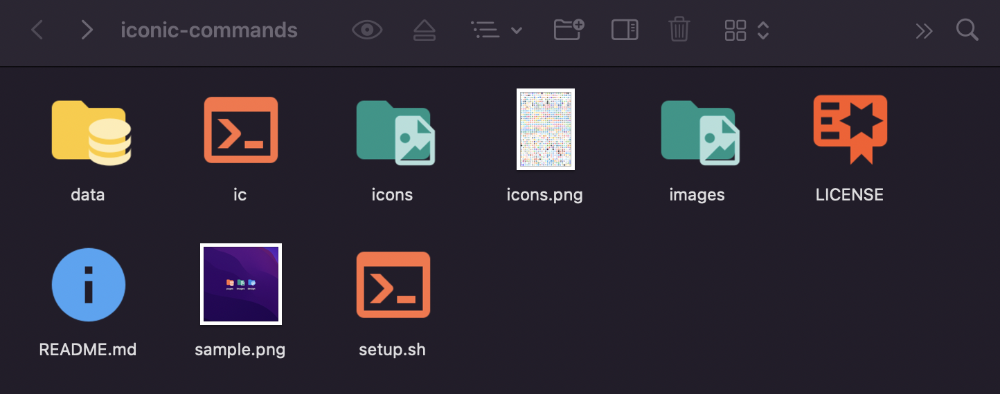
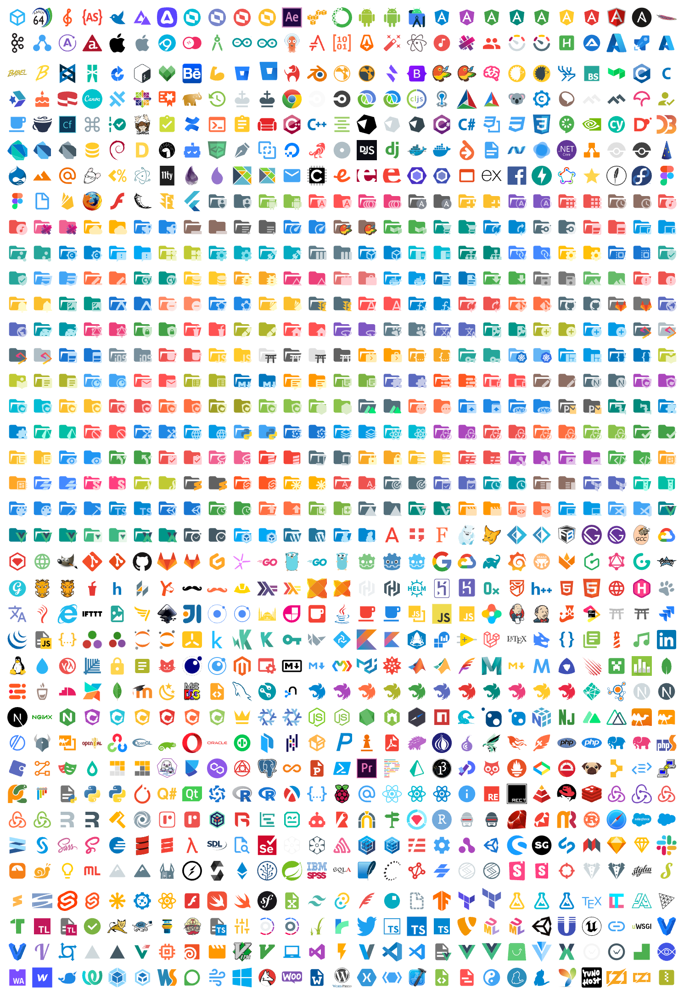

<h1 align="center">Iconic Commands</h1>

<p align="center">
 
 
 
</p>

<p align="center">
  The icon data is used from <a href="https://github.com/PKief/vscode-material-icon-theme">vscode-material-icon-theme</a> and <a href="https://github.com/devicons/devicon/">devicon</a>.
</p>

<div align="center">
 
</div>

## 🎈 Feature

- ✅ Creation of iconic files
- ✅ Creation of iconic directories
- ✅ Conversion to iconic files/directories
- ✅ Support for free icons
- ✅ Creation of original icons
- ✅ Replace all existing folders and files with new icons

## 🙇‍♂️ I am using the following

- [vscode-material-icon-theme](https://github.com/PKief/vscode-material-icon-theme)
- [devicon](https://github.com/devicons/devicon/)
- [librsvg](https://wiki.gnome.org/Projects/LibRsvg)
- [fileicon](https://www.npmjs.com/package/fileicon)

## ⚙️ Setup

```zsh
$ cd ~/
$ git clone https://github.com/ogty/iconic-commands
$ source ~/iconic-commands/setup.sh
```

> **Note**  
> If brew and npm are not installed, they will be installed automatically.  
> The external commands used in this process are also installed at the same time.  
> You may also be asked to enter a password to change permissions.

## 📖 Usage

```zsh
$ ic [options] <command> [<arguments>]
```

## 🤖 Commands

- `file <file-name[@<type>]>`: Change the icon of the specified file
- `dir <directory-name[@<type>]>`: Change the icon of the specified directory
- `make <type-name> <icon-path/icon-url>`: Make your own file icon
- `conv <directory/file-name>@<type>`: Converte file or directory icon
- `replace <directory-name>`: Replaces all files and directories, including the specified directory, with the appropriate icon from the extension or name.

> **Note**  
> Files with the following extensions have a preview function and their icons are not changed.
> - svg
> - png
> - jpg
> - jpeg
> - gif
> - bmp
> - ico
> - tiff
> - tif
> - webp

## 🔍 Options

- `-a, --all`: Can be used with file, dir and make commands
- `-l, --list <f/d>`: Show available icons
- `-h, --help`: Show usage

## ✏️ Example

```zsh
$ ic file command@sh
$ ic dir fundamentals_of_java@java
$ ic conv foo@tmp
$ ic make your-service-name your-service-logo.svg
$ ic make gopher https://raw.githubusercontent.com/devicons/devicon/master/icons/go/go-original.svg
$ ic -l f
$ ic -l d
$ ic -h
$ ic replace bar
```

### 👀 Change the icon for this repository

```zsh
$ ic replace .
$ ic conv ic@sh & ic conv LICENSE@cer & ic conv README.md@readme
```



## 📷 Icons


